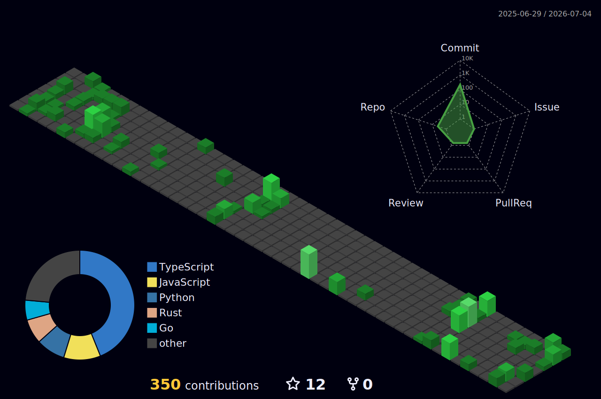
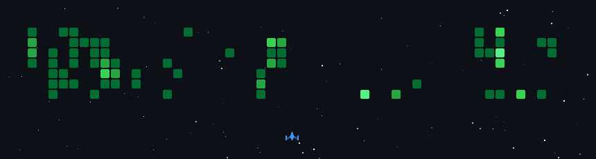

[](https://github.com/byron-villegas)

<p>
Software engineer with 6 years of experience in software development using technologies such as Java, Javascript, Typescript, Spring Framework, Angular. Passionate about being part of multidisciplinary teams to create innovative IT solutions, incorporating the best technologies and practices on the market.

I enjoy facing new challenges, as they allow me to learn about new technologies and acquire valuable experiences for my personal and professional growth. I am actively involved in initiatives, learning and understanding the business to offer solutions that truly meet customer needs.

I am passionate about learning about the technologies that interact in processes and I firmly believe that the best way to learn is by teaching others.
</p>

<p align="center">

</p>

[Enjoy 🎶](https://www.youtube.com/watch?v=BLXuQULWYNw)

```java
public final class AboutMe {
    public static void main(String[] args) {
        SoftwareEngineer me = new SoftwareEngineer("Byron", "Villegas", "Moya",
                29, "🇨🇱");

        me.setSkills(new String[]{"Java", "JavaScript", "TypeScript",
                "Spring Boot", "Spring Framework", "Angular",
                "Node", "Express", "NestJS",
                "Oracle Database", "SQL Server", "Sybase",
                "PostgreSQL", "MySQL", "MongoDB",
                "Redis"});

        me.setCertifications(new String[]{"Java SE 11 Developer",
                "Junior JavaScript Dveloper",
                "Spring Certified Professional 2024 [v2]",
                "Junior Angular Developer",
                "Scrum Master Professional Certificate (SMPC)"});

        me.setPassions(new String[]{"Programming", "Gamming", "Music",
                "Movies", "Anime", "Series"});

        me.presentation();
    }

    static class SoftwareEngineer {
        private String name;
        private String firstLastName;
        private String secondLastName;
        private int age;
        private String country;
        private String[] skills;
        private String[] certifications;
        private String[] passions;

        public SoftwareEngineer(String name, String firstLastName, String secondLastName, int age, String country) {
            this.name = name;
            this.firstLastName = firstLastName;
            this.secondLastName = secondLastName;
            this.age = age;
            this.country = country;
        }

        public void setSkills(String[] skills) {
            this.skills = skills;
        }

        public void setCertifications(String[] certifications) {
            this.certifications = certifications;
        }

        public void setPassions(String[] passions) {
            this.passions = passions;
        }

        public void presentation() {
            System.out.printf("Hi, im %s %s %s%n",
                    this.name, this.firstLastName, this.secondLastName);
            System.out.printf("I'm %d years old and I'm from %s%n", this.age, this.country);
            System.out.println("My skills are:");

            for (String skill : this.skills) {
                System.out.printf("- %s%n", skill);
            }

            System.out.println("My certifications are:");
            for (String certification : this.certifications) {
                System.out.printf("- %s%n", certification);
            }

            System.out.println("My passions are:");
            for (String passion : this.passions) {
                System.out.printf("- %s%n", passion);
            }
        }
    }
}
```

### My Favorite Programming Quotes
[](https://github.com/byron-villegas/byron-villegas/blob/main/my-favorite-programming-quotes.json)

### Certifications
<p align="left">

</p>

### Programming Languages
<p align="left">

</p>

### Frameworks
<p align="left">

</p>

### Persistance
<a href="https://hibernate.org/" target="_blank" rel="noreferrer"></a> <a href="https://blog.mybatis.org/" target="_blank" rel="noreferrer"></a>

### Testing
<a href="https://junit.org/junit5/" target="_blank" rel="noreferrer"></a> <a href="https://groovy-lang.org/" target="_blank" rel="noreferrer"></a> <a href="https://spockframework.org/" target="_blank" rel="noreferrer"></a> <a href="https://site.mockito.org/" target="_blank" rel="noreferrer"></a> <a href="https://docs.pytest.org/en/stable/" target="_blank" rel="noreferrer"></a> <a href="https://jasmine.github.io/" target="_blank" rel="noreferrer"></a> <a href="https://jestjs.io" target="_blank" rel="noreferrer"></a> <a href="https://mochajs.org" target="_blank" rel="noreferrer"></a> <a href="https://karma-runner.github.io/latest/index.html" target="_blank" rel="noreferrer"></a> <a href="https://cucumber.io/" target="_blank" rel="noreferrer"></a> <a href="https://karatelabs.github.io/karate/" target="_blank" rel="noreferrer"></a> <a href="https://www.selenium.dev" target="_blank" rel="noreferrer"></a> <a href="https://playwright.dev/" target="_blank" rel="noreferrer"></a> <a href="https://www.cypress.io" target="_blank" rel="noreferrer"></a> <a href="https://nightwatchjs.org/" target="_blank" rel="noreferrer"></a> <a href="https://testcafe.io/" target="_blank" rel="noreferrer"></a> 

### Build Tools
<p align="left">

</p>

### Web
<p align="left">

</p>

### Web Server
<a href="https://tomcat.apache.org/" target="_blank" rel="noreferrer"></a> <a href="https://nginx.org/en/" target="_blank" rel="noreferrer"></a> <a href="https://jetty.org/" target="_blank" rel="noreferrer"></a>

### Web Application Server
<a href="" target="_blank" rel="noreferrer"></a>

### SQL Database
<p align="left">

</p>

### NoSQL Database
<p align="left">

</p>

### Database Management Tools
<a href="https://dbeaver.io/" target="_blank" rel="noreferrer"></a> <a href="https://www.mongodb.com/docs/compass/current/" target="_blank" rel="noreferrer"></a> <a href="https://studio3t.com/" target="_blank" rel="noreferrer"></a> <a href="https://www.idera.com/dbartisan-database-administration-solution/" target="_blank" rel="noreferrer"></a>  

### Deployment
<p align="left">

</p>

### CI/CD
<p align="left">

</p>

### Cloud Application Platform
<p align="left">

</p>

### Observability
<a href="https://www.dynatrace.com/" target="_blank" rel="noreferrer"></a> <a href="https://grafana.com/" target="_blank" rel="noreferrer"></a> <a href="https://www.splunk.com/" target="_blank" rel="noreferrer"></a>

### Operating Systems
<p align="left">

</p>

### IDE
<p align="left">

</p>

### Code Editor
<p align="left">

</p>

### Version Control
<p align="left">

</p>

### Cloud-based code hosting
<p align="left">

</p>

### Tools
<a href="https://app.diagrams.net/" target="_blank" rel="noreferrer"></a> <a href="https://staruml.io/" target="_blank" rel="noreferrer"></a> <a href="https://www.powerdesigner.biz" target="_blank" rel="noreferrer"></a> <a href="https://balsamiq.com/" target="_blank" rel="noreferrer"></a> <a href="https://postman.com" target="_blank" rel="noreferrer"></a> <a href="https://jmeter.apache.org/" target="_blank" rel="noreferrer"></a> <a href="https://www.soapui.org/" target="_blank" rel="noreferrer"></a> <a href="https://www.jenkins.io" target="_blank" rel="noreferrer"></a> <a href="https://k8slens.dev/" target="_blank" rel="noreferrer"></a> <a href="https://tortoisesvn.net/downloads.html" target="_blank" rel="noreferrer"></a>

### My Stats

[](https://github.com/byron-villegas)

<p>
    
</p>

<!--START_SECTION:waka-->

```txt
From: 10 November 2024 - To: 03 May 2026

Total Time: 459 hrs 52 mins

TypeScript            79 hrs 51 mins        >>>>---------------------   17.27 %
JavaScript            71 hrs 44 mins        >>>>---------------------   15.52 %
JSON                  66 hrs 34 mins        >>>>---------------------   14.40 %
Java                  65 hrs 31 mins        >>>>---------------------   14.17 %
Rust                  31 hrs 58 mins        >>-----------------------   06.92 %
Markdown              27 hrs 42 mins        >------------------------   05.99 %
Python                22 hrs 2 mins         >------------------------   04.77 %
YAML                  14 hrs 1 min          >------------------------   03.03 %
HTML                  10 hrs 56 mins        >------------------------   02.37 %
Groovy                10 hrs 34 mins        >------------------------   02.29 %
```

<!--END_SECTION:waka-->





<br/>
<br/>

[](https://komarev.com/ghpvc/?username=byron-villegas&label=Profile%20views&color=blue&style=flat-square)
[](https://wakatime.com/@0c6efff5-affd-454b-bc74-bccb7e22edf3)
